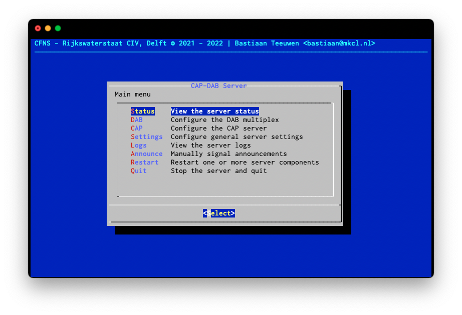
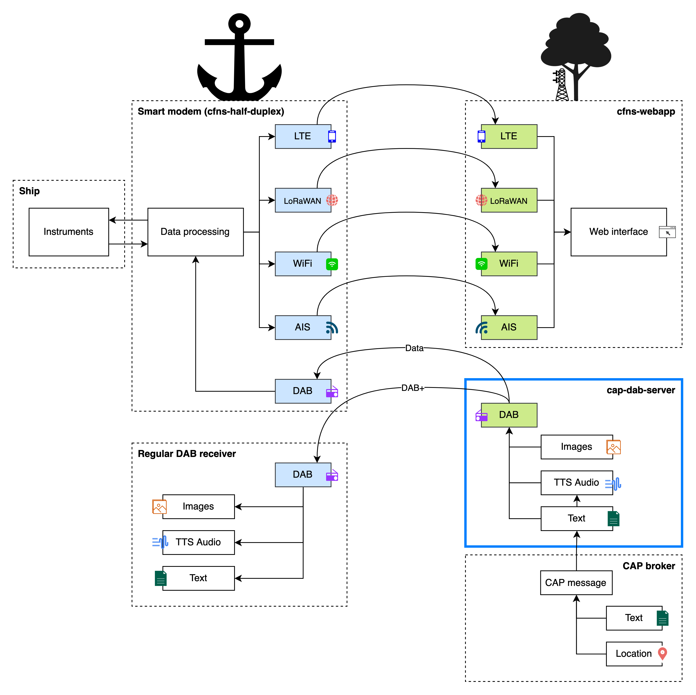

cap-dab-server is a piece of software that combines existing DAB broadcasting
utilities (from ODR-mmbTools) with a friendly user-interface into a solution
capable of translating CAP (Common Alerting Protocol) messages to a DAB/DAB+
emergency warning broadcast.



Features include:
- A TUI management interface to view status, logs and configure general settings
- Simple TUI configuration of the DAB multiplexer
- Option to send warning messages using the DAB Alarm announcement or "old
  school" stream replacement (see also "Warning method").
- Ability to switch channel's stream sources on the fly
- Spoken (Text To Speech) CAP description
- Option to send raw CAP messages as packet data over DAB (for integration with
  [cfns-half-duplex](https://github.com/PoCDAB/cfns-half-duplex), see image
  below)



# Installation
Requirements:
- dialog (TUI)
- espeak-ng (on Linux only)
- ffmpeg (Convert mp3 TTS output to wav)
- gstreamer (GStreamer input, optional)
- odr-audioenc (DAB/DAB+ Encoder)
- odr-padenc (DAB PAD Encoder)
- odr-dabmux (DAB Multiplexer)
- odr-dabmod (DAB Modulator)
- Python 3.9+
- python-Flask (HTTP server)
- python-pyttsx3 (TTS)
- python-pythondialog (TUI)
- python-pyzmq (IPC with ODR-mmbTools)

Clone this repository and install above dependencies using the instructions for
your platform below.

## odr-mmbTools
You'll have to compile and install odr-mmbTools manually. By default,
cap-dab-server assume the binaries to be installed to `/usr/local/bin`. This can
be changed in the server settings after the first run.

odr-mmbTools need to be configured with __at least__ the following features:

```
odr-audioenc:	--enable-gst (gst)
odr-padenc:	(magickwand)
odr-dabmux:	--enable-output-raw (file fifo udp tcp raw simul zmq)
odr-dabmod:	
```

## Debian/Ubuntu
```
$ sudo apt install dialog espeak-ng gstreamer1.0-plugins-* libespeak-ng-libespeak1 ffmpeg python3 python3-dialog python3-flask python3-pip
$ pip3 install --user pyttsx3 pyzmq
```

## macOS
```
$ brew install dialog ffmpeg gstreamer python
$ pip3 install --user flask pyttsx3 pythondialog pyzmq
```

## Windows
TODO

# Configuration
Configuration is largely done using the Admin TUI (Terminal User Interface).

> **_NOTE:_** Currently the Admin Interface is closely integrated with the
> CAP-DAB server.
> This means the cap-dab-server is not able to run in the background. Running
> the server is the background is still possible using terminal multiplexer such
> as GNU Screen and detaching from the session.

A DAB in cap-dab-server ensemble consists of services and streams. A DAB
ensemble is broken down into one or more services. Services provide _one_
stream, which can be i.e. a HTTP audio stream, a named pipe with arbitrary data
or single (looped) audio file.  
A stream consists of one or more service components, which refer to for instance
an audio stream and a data stream. cap-dab-server limits

TODO image of the relation between streams, services, subchannels and components

## Ensemble
First, let us configure our ensemble.
1. Start cap-dab-server by running:
```
$ ./main.py
```
2. You'll be presented with several options, let's navigate to `DAB` >
   `Ensemble` first. Here, change your Country and Ensemble Label from the
   defaults where needed.

In section 'Alarm announcements', we'll configure which announcement will switch
to which stream later.

> **_NOTE:_** When navigating back to `DAB Configuration`, make sure to press
> `Save` to save your configured changes and restart the DAB server.

## Services and Streams
When cap-dab-server is first started, a simple ensemble is automatically
configured, but services and stream have to be added manually before you can
begin broadcasting.

Let's add a __stream__ first.
1. From the main menu, go to `DAB` > `Streams` > `Add`.
2. Enter a simple identifier for the stream such as `sub-audio`.
3. Now, set the stream source by selecting `Stream Input`. Let's make this a
   DAB+ stream. Navigate to `DAB+` with the arrow keys and press `Spacebar` to
   select.  
   `Return` will move to the next screen.
4. Select the input source type, choose GStreamer to use a HTTP webstream for
   example.
5. In the next screen, enter the path (for File and FIFO) or the GSTURI (for
   GStreamer). In our example, we'll use a local VLC instance streaming a
   playlist on 127.0.0.1:1234. Enter `http://127.0.0.1:1234` and press `Return`.
6. We are all done for now.  
   The remaining options can be modified later, but the defaults are relatively
   sane.

Let's add a new __service__ now.
1. Navigate back to `DAB Configuration` and go to `Services` > `Add`.
2. Enter a identifier such as `srv-audio` and press `Return`.
3. For the service ID, use any value, such as `dab` and press `Return`.
4. In the next screen, select the stream we've just created.
5. All done for now.  
   From here, you can optionally configure any other service parameters if you
   desire.

> **_NOTE:_** When navigating back to `DAB Configuration`, make sure to press
> `Save` to save your configured changes and restart the DAB server.

## Broadcasting
From the main menu, check that

TODO modulator configuration

## Alarm announcements
TODO

## CAP announcements
TODO

# Warning method
TODO

# Limitations
- OE (Other Ensemble) announcement switching is not supported
- Secondary service components are currently not configurable from the TUI

# TODO
- [x] Automatically create fifo
- [x] Stream class
- [x] Stream management
- [x] Implement stream replacement without use of external scripts
- [x] TTS
- [x] Implement ability to cancel announcements
- [ ] Change Alarm channel/stream replacement DLS text (and change back after cancel)
- [x] Configurable label, pty and such for stream replacement/alarm channel
- [x] Manual announcement triggering
- [ ] GUI config - Ensemble announcement
- [x] GUI config - Service PTY and Announcement
- [ ] GUI config - Subchannels
- [ ] GUI config - Stream
- [ ] GUI config - DAB modulator
- [ ] GUI config - Packet address
- [x] Settings - CAP identity
- [ ] Logging - Add stream logs to GUI
- [x] Option to use ODR-DabMod config file instead of fifo output
- [ ] Option to restart threads that have quit
- [x] Use ZeroMQ ipc instead of telnet for communication with odr-dabmux
- [x] Allow user to select which announcement to use for CAP messages
- [ ] Implement more of the CAP spec (message updates, ...)
- [ ] Split admin interface from server component
- [ ] Don't start the CAP server and Watcher thread if all warning methods are disabled

# Known issues
- DAB data streams don't properly shut down because read blocks the stream thread
- English (en-US) TTS output doesn't generate correctly on macOS, consider using
  another TTS library than pyttsx3

# License
This project is licensed under the GNU General Public License v3.0. See
`LICENSE` for more information.

# Credits
Credits to [OpenDigitalRadio](http://www.opendigitalradio.org/) for the
excellent open-source ODR-mmbTools DAB/DAB+ software tools.

Credits to Felix Morgner and Tobias Stauber for their work on the
[data-over-dab-example](https://github.com/Opendigitalradio/data-over-dab-example)
code. I have derived from their work and (mostly) rewritten it in Python to
integrate into this project.

Credit to Adeola Bannis of the University of California for [BoostInfoParser](https://gist.github.com/thecodemaiden/dc4e4e4a54eaa5f0be84).
